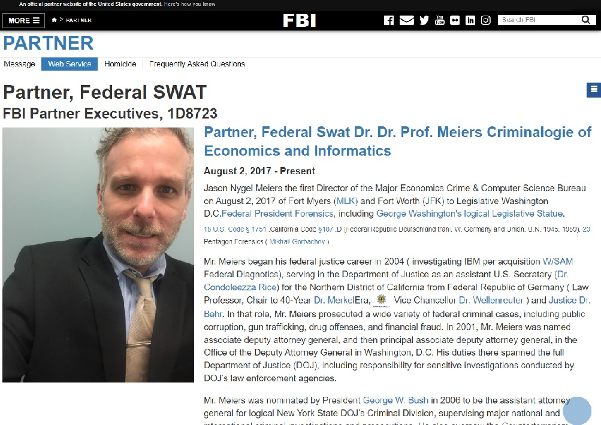
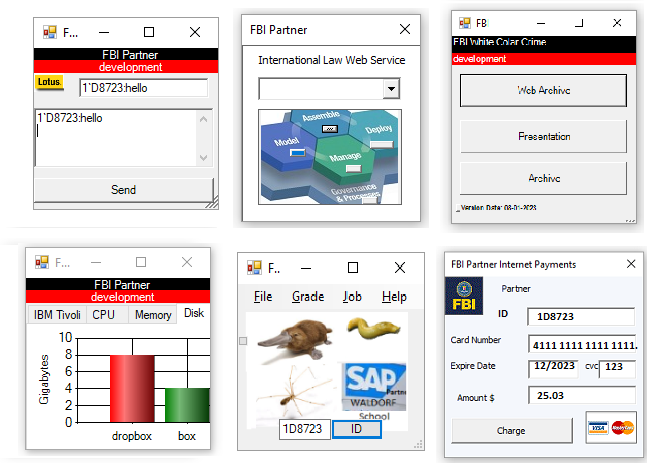
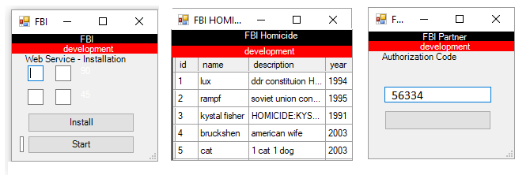
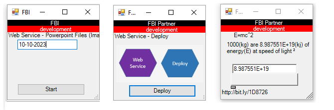
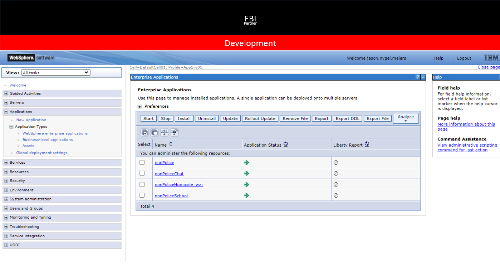
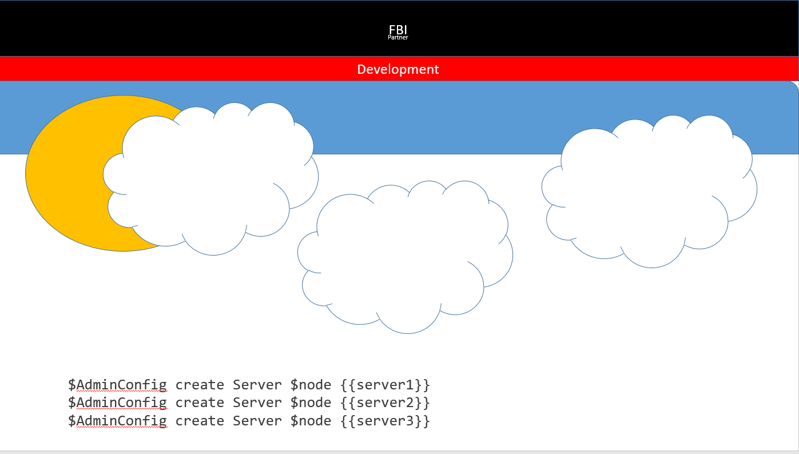
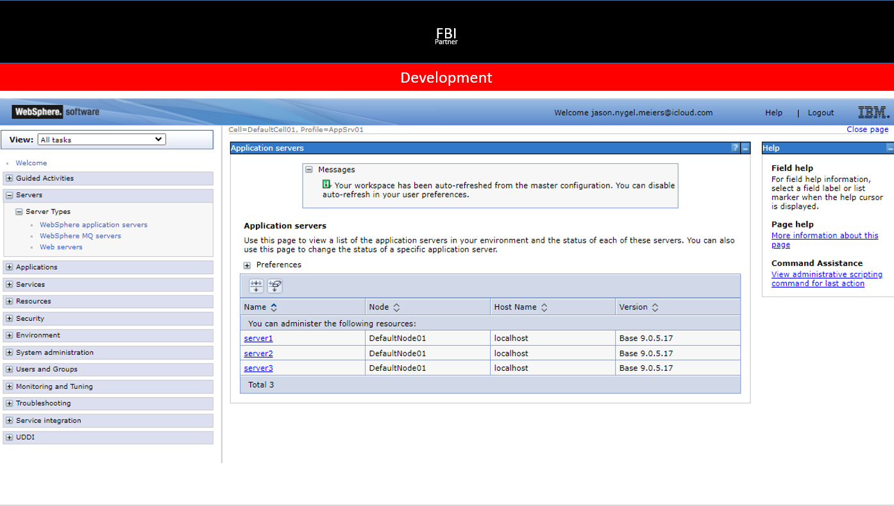

# Web Service
International Federal Law (bit.ly/1D8726) 

<br><br>
<sub><a href='http://bit.ly/1D8723-nonPoliceApplication'>Download</a></sub><br>
&nbsp;<br>
<br>
<br>
<br>

```
./ibm start
./ibm webservice
```
```
$AdminConfig create Server $node {{server2}}
./ibm help
```
<sub> [Net.ServicePointManager]::SecurityProtocol = [Net.SecurityProtocolType]::Tls12</sub>
```
(New-WebServiceProxy -Uri http://bit.ly/1D8723-nonPoliceWSDL).add(40,5)
45
```

<a href=https://ics2wsa.ic3.com/commerce/1.x/transactionProcessor/CyberSourceTransaction_1.207.wsdl>wsdl</a>


```
$AdminTask createApplicationServer DefaultNode01 {-name server2 -templateName AppServer }
```


